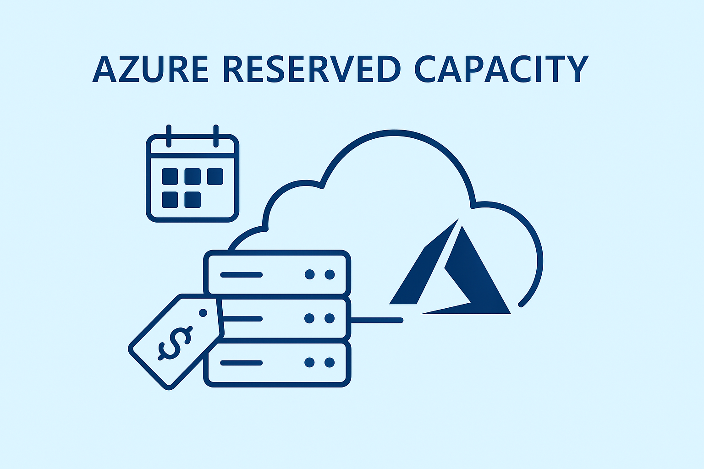

# Azure Reserved Capacity

## ⚠️ **WARNING - DEMO REPOSITORY** ⚠️

**This is a demonstration repository for educational and testing purposes only. Use at your own risk.**

- ❌ **NO SUPPORT** - No technical support or assistance is provided
- ❌ **NO WARRANTY** - No guarantees of functionality, reliability, or suitability for any purpose
- ❌ **NO LIABILITY** - Authors are not responsible for any damages or issues arising from use
- ⚠️ **NOT PRODUCTION READY** - This code is not intended for production environments

By using this repository, you acknowledge and accept these limitations.

---

A repository for testing and managing Azure Reserved Capacity implementations.

## Overview

This project provides automated tools to help manage Azure Reserved Capacity, allowing you to optimize costs by reserving Azure compute resources in advance.

## What's Included

### 🔧 Core Script
- **[script.sh](src/script.sh)** - Intelligent script that incrementally creates Reserved Capacity Groups and Reserved Capacity with automatic retry logic

### 🚀 GitHub Workflows

#### 1. **Test Azure Reserved Capacity** (`test-reserved-capacity.yml`)
**Purpose**: Safe testing and validation of Reserved Capacity configuration
- ✅ **Dry-run mode** for validation without creating resources
- ✅ **Live-run mode** for actual resource creation  
- ✅ **Flexible parameters** via GitHub Actions UI
- ✅ **Parameter validation** and subscription checks

#### 2. **General Deploy Demo** (`deploy.yaml`) 
**Purpose**: Complete demonstration environment with Reserved Capacity + VMs
- 🏗️ **Full demo setup** including VMs that use the Reserved Capacity
- ⏰ **Auto-cleanup** with configurable delay (up to 5.5 hours)
- 🧪 **Over-provisioning test** to validate capacity limits
- 💰 **Cost management** through automatic resource destruction

## Prerequisites

- Azure subscription
- Azure service principal with appropriate permissions
- GitHub repository secrets and variables configured

## Configuration

Configure your Azure credentials and subscription settings before running scripts.

### Required GitHub Secrets

Configure the following secrets in your repository settings (`Settings > Secrets and variables > Actions`):

- `AZURE_CLIENT_SECRET` - Azure service principal client secret

### Required GitHub Variables

Configure the following variables in your repository settings (`Settings > Secrets and variables > Actions`):

- `AZURE_LOGIN` - Azure service principal client ID
- `AZURE_TENANT_ID` - Azure AD tenant ID

## Usage Guide

### 🧪 Testing Reserved Capacity (Recommended First Step)

Use the **Test Azure Reserved Capacity** workflow for safe validation:

1. **Navigate**: Go to **Actions** tab → **Test Azure Reserved Capacity**
2. **Configure**: Click **Run workflow** and set parameters:
   - `subscription_id`: Your Azure subscription ID
   - `resource_group_name`: Target resource group name  
   - `reserved_capacity_group_name`: Name for capacity reservation group
   - `location`: Azure region (East US, West Europe, etc.)
   - `capacity_amount`: Number of capacity units (start with 1)
   - `dry_run`: ✅ **Enable for validation** (recommended first run)
3. **Execute**: Click **Run workflow**

**💡 Best Practice**: Always run with `dry_run: true` first to validate your configuration!

### 🚀 Demo Environment (Full Deployment)

Use the **General Deploy Demo** workflow for complete testing:

1. **Navigate**: Go to **Actions** tab → **General - Deploy demo**
2. **Configure**: Click **Run workflow** and set:
   - `REGION`: Azure region (e.g., northeurope, eastus)
   - `RESOURCE_GROUP`: Resource group name (will be created)
   - `DESTROY_DELAY_SECONDS`: Auto-cleanup delay (0-20000 seconds, 0=no cleanup)
3. **Execute**: Click **Run workflow**

**⚠️ Important**: This creates real Azure resources and VMs. Monitor costs!

### 💻 Manual Script Execution

Run the script directly with custom parameters:

```bash
# Dry run validation
./src/script.sh \
  --subscription-id "your-subscription-id" \
  --resource-group "test-rg" \
  --location "eastus" \
  --capacity 1 \
  --dry-run

# Live execution  
./src/script.sh \
  --subscription-id "your-subscription-id" \
  --resource-group "prod-rg" \
  --rcg-name "my-capacity-group" \
  --location "westeurope" \
  --capacity 3
```

## Workflow Comparison

| Feature | Test Workflow | Deploy Demo |
|---------|---------------|-------------|
| **Purpose** | Validation & Testing | Complete Demo |
| **Creates VMs** | ❌ No | ✅ Yes (3 VMs) |
| **Dry Run Mode** | ✅ Yes | ❌ No |
| **Auto Cleanup** | ❌ Manual | ✅ Configurable |
| **Cost Impact** | 💚 Low (RC only) | 🟡 Medium (RC + VMs) |
| **Recommended For** | First-time users, Validation | Demo, Testing capacity usage |

## Troubleshooting

### Common Issues

**🔐 Authentication Errors**
- Verify `AZURE_CLIENT_SECRET`, `AZURE_LOGIN`, and `AZURE_TENANT_ID` are configured
- Check service principal has `Contributor` role on target subscription

**📍 Location/Region Issues**  
- Use exact region names: `eastus`, `westeurope`, `francecentral`
- Verify chosen region supports Reserved Capacity for your VM SKU

**💾 Capacity Allocation Failures**
- Start with `capacity: 1` for initial testing
- Some VM SKUs have limited availability in certain regions
- Try different availability zones if allocation fails

**🔄 Script Retry Logic**
- Script automatically retries failed operations with exponential backoff
- Default retry interval: 1 hour (`--sleep-seconds 3600`)
- Check logs for detailed error information

### Getting Help

- 📋 **View logs**: Check GitHub Actions run logs for detailed error messages
- 🧪 **Test first**: Always use dry-run mode before live execution  
- 🔍 **Debug**: Use `--dry-run` flag to validate parameters without creating resources

## Contact

For questions or support, please open an issue in this repository.
